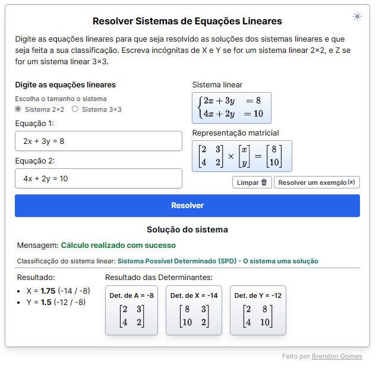

# Resolvedor de Sistema Linear

Este projeto é uma simples página, feita com HTML, CSS e principalmente em JavaScript para resolver os sistemas lineares usando o método de Cramer. Para acessar esse projeto basta [acessar essa página](https://brendon3578.github.io/linear-system-resolver/src/index.html)

<p align="center">
   
</p>

## Como baixar e usar localmente

1. **Clonar o Repositório:**

   Clone este repositório em seu sistema local usando o seguinte comando:

   ```bash
   git clone https://github.com/Brendon3578/linear-system-resolver.git
   ```

2. **Abrir o Programa:**

   Abra o arquivo `index.html` localizado na pasta `src` em qualquer navegador da web.

3. **Interagindo com o Programa:**

   A página abrirá em seu navegador, onde você poderá inserir as equações dos sistemas lineares, que pode ser do tipo 2x2 ou 3x3. Em seguida. O programa fornecerá a solução do sistema linear usando o método de Cramer e mostrará também a representação matricial o sistema linear, e classificará o sistema linear.

## Licença

Este projeto é licenciado sob a [Licença MIT](./LICENSE).

---

<h3 align="center">
    Feito com ☕ por <a href="https://github.com/Brendon3578"> Brendon Gomes</a>
</h3>
